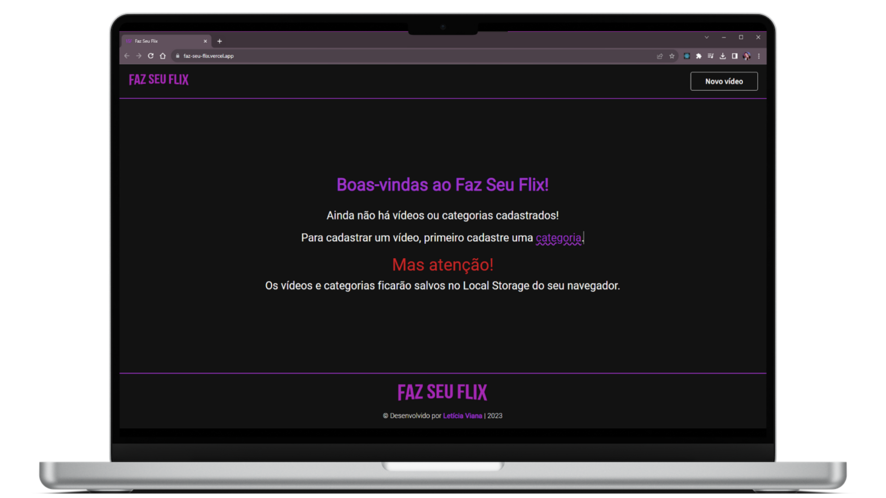
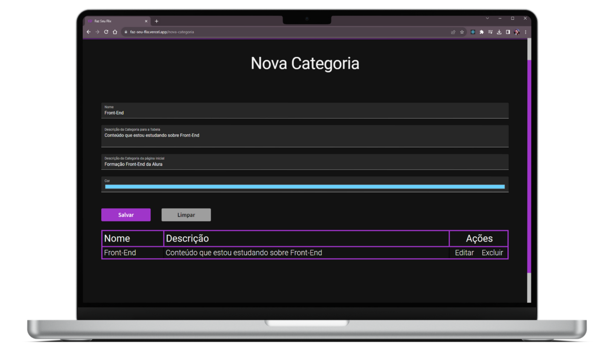
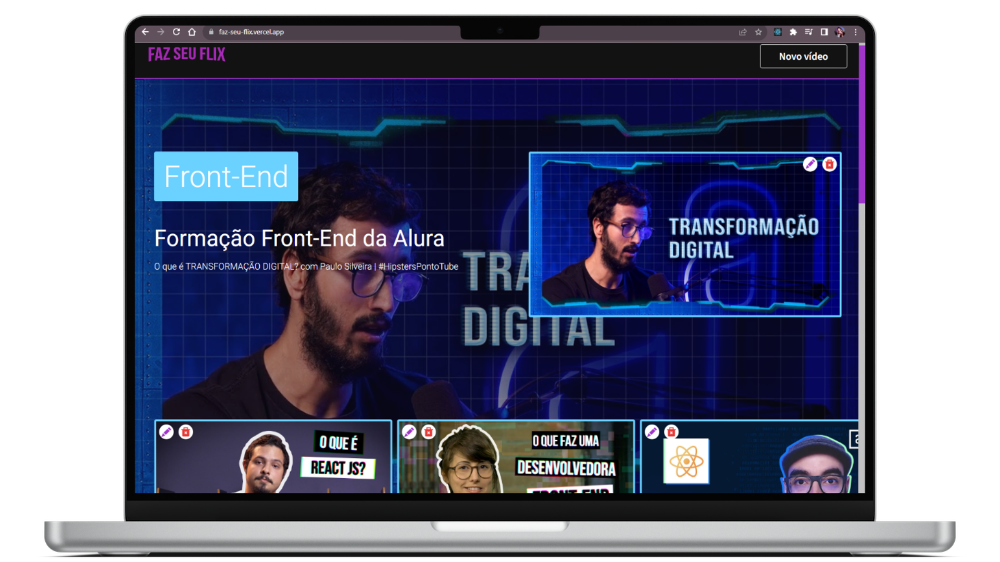
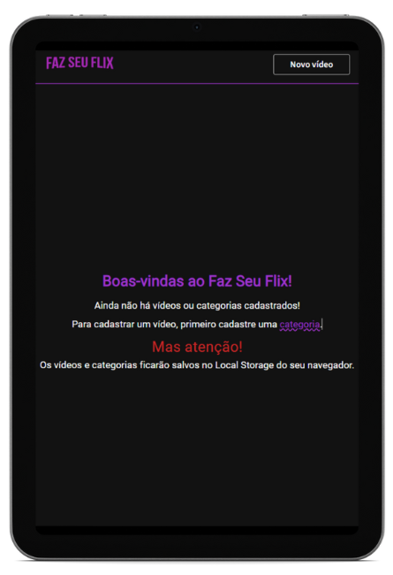
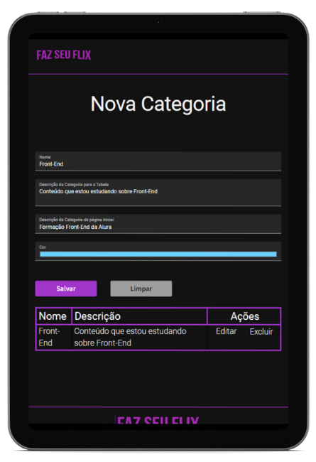
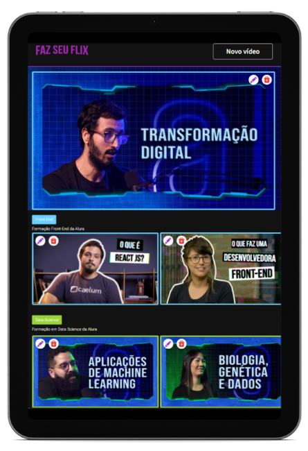
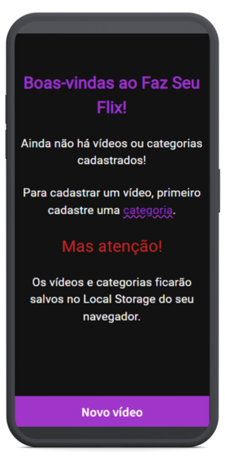
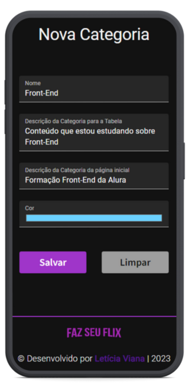
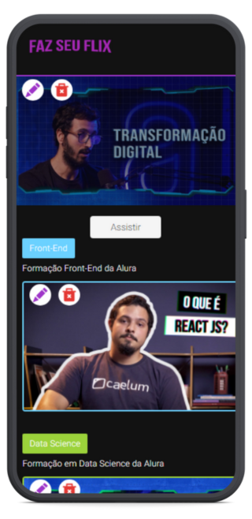

# **React + Vite**

# **Challenge ONE - Aluraflix**

## **Sobre o projeto Aluraflix**

A proposta inicial do challenge Aluraflix é ser um Netflix da Alura. Nele você teria sugestões de vídeos relacionados com os seus interesses educacionais e além disso poderia adicionar novas categorias e novos vídeos na plataforma. Porém, decidi fazer algumas alterações que serão devidamente explicadas na seção [Minhas implementações](#3-minhas-implementacoes). 

    

#

## **Índice:**

1. [Requisitos](#1-requisitos) 
2. [Como usar](#2-como-usar)
3. [Minhas implementações](#3-minhas-implementações)
4. [Tecnologias utilizadas](#4-linguagenstecnologias-utilizadas)
5. [Imagens do projeto](#5-imagens-do-projeto)
6. [Status](#6-status)
7. [Autora e contato](#7-autora-e-contato)
8. [Licença](#8-licença)

#

### **1. Requisitos**

O objetivo do Aluraflix é ser um Netflix da Alura. Nele você terá sugestões de vídeos relacionados com os seus interesses educacionais e além disso poderá adicionar novas categorias e novos vídeos na plataforma.

#

### **2. Como usar**

1. Alternativa 1:
    - Acesse por [este link](). 
    - Comece cadastrando uma nova categoria.
    - Depois, cadastre um novo vídeo.
    - Repita o processo conforme for necessário.
    - **Obs.:** O arquivo Json em src > data contém algumas categorias e vídeos padrão que eu estava usando para simular as interações.
    - **ATENÇÃO:** os vídeos e categorias serão salvos no seu Local Storage. Preste atenção nisso conforme usar!

2. Alternativa 2:
    - Clone o repositório clicando em "Code" e copie a URL em HTTPS.
    - Para facilitar, na pasta onde deseja que o projeto fique, segure a tecla SHIFT e clique com o botão direito do mouse, e selecione "Git Bash Here". Certifique-se de ter o Git instalado.
    - Dê o comando `git clone <URL-copiada>` e pressione Enter. Isso copiará o projeto.
    - Agora você pode abrir o projeto tanto pelo Git (fazendo o percursos do `cd <nome-do-projeto>`) quanto pelo seu Editor de Código (IDE) preferido.
    - Instale as dependências necessárias do projeto com o comando `npm install` ou `npm i`, pelo terminal ou diretamente pela IDE.
    - Execute o comando `npm run dev` no terminal e: ou copie o link que aparece no terminal no seu navegador de preferência ou segure CTRL e clique no link que isso abrirá o projeto diretamente no último navegador utilizado.

# 

### **3. Minhas implementações**

- Logo e título do site diferentes do proposto no Figma.
- Cor principal diferente da proposta no Figma.
- Favicon personalizado de acordo com o nome do site.
- Página inicial para que o usuário possa fazer suas primeiras interações de cadastrar categorias e vídeos.
- Botões nos cards dos vídeos para editá-los ou exclui-los.
- Páginas para editar os vídeos e as categorias.
- O banner e o vídeo que aparecem no início correspondem ao do último vídeo cadastrado.
- O primeiro carrossel é renderizado de acordo com a categoria do último vídeo cadastrado.
- Imagem padrão caso o usuário não coloque um link para a imagem.
- Scrollbar personalizado.
- Página 404 para quando o usuário digitar algum endereço na barra de pesquisa que não exista na página.

#

### **4. Linguagens/tecnologias utilizadas**

 
    
    
    
    
    

 

#

### **5. Imagens do projeto**

    
    
    
    
    
     
    
    
     

#

### **6. Status**

- [x] Funcional.
- [x] Responsivo.
- [x] Concluído, porém ainda pode apresentar alguns bugs que eu vou corrigindo conforme for encontrando.

#

### **7. Autora e contato**

#

### **8. Licença**

Em breve.